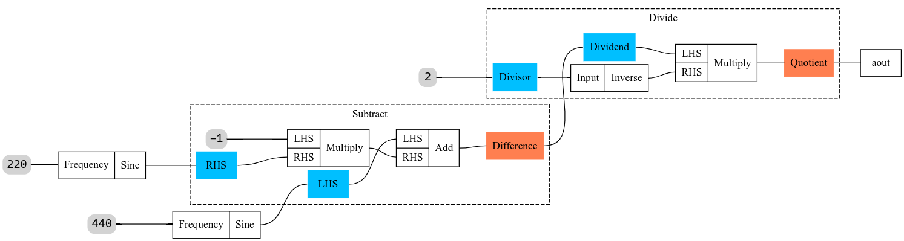

# DaGrid
THIS IS NOT A FINISHED PROJECT. GO ELSEWHERE! GRAAAAAAAH

## Features :)

It can turn this code:
```rust
let mut cg = glicol::std_cg();

// Create 440hz and 220hz oscillators
let sine_osc_1 = cg.connect_const_new(440.0, Sine);
let sine_osc_2 = cg.connect_const_new(220.0, Sine);

// Subtract oscillator 1 from oscillator 2
let (sub_in, sub_out) = cg.insert_container(Sub);
cg.connect_ex_ex(sine_osc_1, sub_in[0]);
cg.connect_ex_ex(sine_osc_2, sub_in[1]);

// Audio out must be in range (-1 < x < 1)
// divide by 2 to avoid exceeding that
let (div_in, div_out) = cg.insert_container(Div);
cg.connect_ex_ex(sub_out[0], div_in[0]);
cg.connect_const_ex(2.0, div_in[1]);

// Connect product to audio output
cg.connect_existing_aout(div_out[0]);
```

Into this graph:



And into this audio (warning - loud):


## Building

| Command              | Action                                           |
| -------------------- | ------------------------------------------------ |
| `cargo dgbundle`     | Compiles and bundles `dagrid-plugin-export.clap` |
| `cargo dgplug`       | Compiles the DaGrid plugin without bundling      |
| `cargo build`        | Compiles the standalone DaGrid binary            |
| `cargo dgtest`       | Runs tests                                       |
| `cargo dgbench`      | Runs benchmarks                                  |
| `cargo dgflamegraph` | Runs and profiles benchmarks                     |

## Credits
- [Robbert van der Helm](https://github.com/robbert-vdh) for [`nih-plug`](https://github.com/robbert-vdh/nih-plug) - the audio plugin framework used by DaGrid. While unrelated to this project, if you're on Linux and looking to use Windows audio plugins, check out [`yabridge`](https://github.com/robbert-vdh/yabridge).
- [Dan Gohman](https://github.com/sunfishcode) for [`eyra`](https://github.com/sunfishcode/eyra). Used for detailed profiling. Without it, I'll see calls to `libm.so.6` in the flamegraph without any helpful information. With it, I can see that it's calling `k_cos`, `k_sin`, `rem_pio2`, etc.
- [The Flamegraph Contributors](https://github.com/flamegraph-rs) for [`flamegraph`](https://github.com/flamegraph-rs/flamegraph) and [Jon Gjengset](https://github.com/jonhoo) for [`inferno`](https://github.com/jonhoo/inferno). Super simple profiler that works with benchmarks.
- [Brook Heisler](https://github.com/bheisler) for [`criterion`](https://github.com/bheisler/criterion.rs). The best benchmarking framework around.
- [Qichao Lan](https://github.com/chaosprint) for [`glicol`](https://github.com/chaosprint/glicol). Used to create reproducible reference audio for tests.
- [The Petgraph Contributors](https://github.com/petgraph) for [`petgraph`](https://github.com/petgraph/petgraph). A fundamental component of DaGrid.